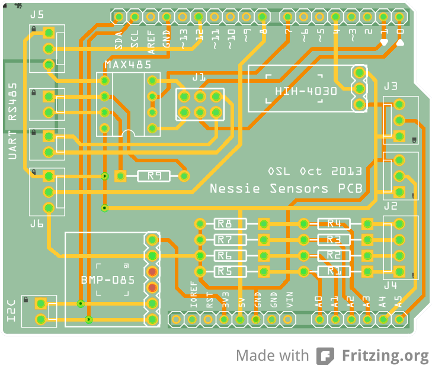

Analog Sensors Shield
=====================

__Analog Sensors Shield__ is an Arduino Leonardo shield used to interface a robotic platform with analog sensors for internal environmental monitoring and platform managment.

The shild is using most of the analog inputs available on the Leonardo, reading data from 4 temperature sensors (LM35), 4 voltage divider for battery monitoring and a small humidity sensor (HIH-4030). 

In addition to the analog sensors the shield is using a BMP085 barometric pressure sensor interfaced with the I2C bus to provide extra temperature reading and platform monitoring. The BMP085 is powered by the Arduino itself using the 3.3V pin. To further expand the shield capabilities a MAX485 is included to provide an optional RS485 interface (using the J1 header one can select between UART or RS485 connectivity). The serial interfacing is achived using the Arduino hardware serial (pin 0 and 1) while the communication with the host is achieved using the 32U4 USB connection (using the CDC virtual serial profile as supported by Arduino Leonardo).

### Components

* 4 x LM35 analog temp sensor
* 4 x 24kOhm resistors (1%)
* 4 x 2.2kOhm resistors (1%)
* 1 x 150Ohm resistor (1%)
* 1 x BMP085 Breakout
* 1 x HIH-4030 Breakout

For a more detailed list look at [the bill of materials](extra/osl_sensors_bom.md) (or [html version](extra/osl_sensors_bom.html)) in the [extra](extra) subdir.

### Software

An example client python script is included in the [scripts](scripts) subdir, demostrating the use of the shield over the virtual serial connection (handling reconnects and catching exceptions). Being a an USB virtual serial connection means that the virtual interface is managed (using latest Linux distro) by `udev` subsystem and it will be attatched to the first available `/dev/ttyACMx` character device. To avoid this and to have a working symlink across reconnections customize the [rules](extra/99-local.rules) file with your Arduino's VID and PID.

Keep in mind that some extra features are missing but feel free to add or suggest them. Just clone or fork the git repository if you want to kickstart a new project.

## References

* [Temperature Sensor Tutorial](http://learn.adafruit.com/tmp36-temperature-sensor) 
* [HIH-4030 Humidity Sensor](https://www.sparkfun.com/products/9569)
* [HIH-4030 Tutorial](http://bildr.org/2012/11/hih4030-arduino/)
* [HIH-4030 Interpolation](http://forum.arduino.cc/index.php/topic,19961.0.html)
* [BMP085 Barometric Pressure Sensor](https://www.sparkfun.com/products/11282)
* [BMP085 Tutorial](https://www.sparkfun.com/tutorials/253)

## LICENSE - "MIT License"

Copyright (c) 2013-2014 Valerio De Carolis, http://decabyte.it

Permission is hereby granted, free of charge, to any person
obtaining a copy of this software and associated documentation
files (the "Software"), to deal in the Software without
restriction, including without limitation the rights to use,
copy, modify, merge, publish, distribute, sublicense, and/or sell
copies of the Software, and to permit persons to whom the
Software is furnished to do so, subject to the following
conditions:

The above copyright notice and this permission notice shall be
included in all copies or substantial portions of the Software.

THE SOFTWARE IS PROVIDED "AS IS", WITHOUT WARRANTY OF ANY KIND,
EXPRESS OR IMPLIED, INCLUDING BUT NOT LIMITED TO THE WARRANTIES
OF MERCHANTABILITY, FITNESS FOR A PARTICULAR PURPOSE AND
NONINFRINGEMENT. IN NO EVENT SHALL THE AUTHORS OR COPYRIGHT
HOLDERS BE LIABLE FOR ANY CLAIM, DAMAGES OR OTHER LIABILITY,
WHETHER IN AN ACTION OF CONTRACT, TORT OR OTHERWISE, ARISING
FROM, OUT OF OR IN CONNECTION WITH THE SOFTWARE OR THE USE OR
OTHER DEALINGS IN THE SOFTWARE.
